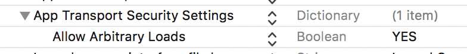
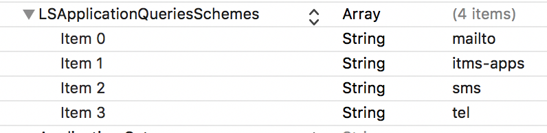
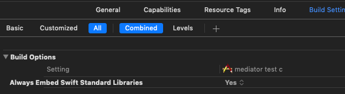

## <div dir="rtl">آموزش راه اندازی کتاب‌خانه TapsellPlus در Unity پلتفرم Android</div>

#### <div dir="rtl">برای استفاده از این کتابخانه باید از build system گردل استفاده کنید. همچنین سعی کنید از آخرین نسخه unity استفاده کنید.</div>

### <div dir="rtl">اضافه کردن کتابخانه به پروژه</div>

<div dir="rtl">نسخه 2.0</div>
<div dir="rtl">ابتدا <a href="https://github.com/tapsellorg/TapsellPlusSDK-UnitySample/releases/download/v2.0/TapsellPlusUnity-v2.0.unitypackage">unity package</a> تپسل پلاس را دانلود و مطابق توضیحات زیر به پروژه اضافه کنید. سپس هر adNetwork که تپسل پشتیبانی میکند و مایل هستید را مطابق توضیحات به پروژه اضافه کنید. در انتها با روش‌های تست مطمعن شوید که adNetwork مورد نظر به درستی کار میکند.<br /> <br /></div>


<div dir="rtl">از player settings قسمت publishing settings تیک custom gradle template رو بزارید.</div>

<div dir="rtl">خطوط زیر را در بخش android فایل mainTemplate.gradle در صورتی که وجود ندارد اضافه کنید.</div>

```gradle
android {
  compileOptions {
    sourceCompatibility JavaVersion.VERSION_1_8
    targetCompatibility JavaVersion.VERSION_1_8
  }
}
```

#### <div dir="rtl">برای اضافه کردن کتابخانه‌های مورد نیاز ۲ روش وجود دارد از هرکدام که مایل هستید استفاده کنید.</div>
#### <div dir="rtl">روش اول استفاده از gradle</div>

<div dir="rtl">خطوط زیر را در بخش dependencies فایل mainTemplate.gradle در مسیر Assets/Plugins/Android اضافه کنید. توجه داشته باشید که ۲ قسمت dependencies وجود دارد، این تغییرات باید در قسمت دوم انجام شود.</div>

```gradle
...
dependencies {
  implementation fileTree(dir: 'libs', include: ['*.jar'])
  implementation 'ir.tapsell.plus:tapsell-plus-sdk-unity:1.0.10'
**DEPS**}
...
```

<div dir="rtl">در نسخه‌های قدیمی یونیتی ممکن هست implementation شناخته نشود در این صورت از compile استفاده کنید.<br /><br /></div>

<div dir="rtl">هر یک از خطوط زیر که در بخش allprojects -> repositories فایل mainTemplate.gradle وجود ندارد اضافه کنید.</div>

```
...
allprojects {
    repositories {
        google()
        jcenter()
        flatDir {
            dirs 'libs'
        }

        maven {
            url 'https://dl.bintray.com/tapsellorg/maven'
        }
    }
}
...
```

<div dir="rtl">هنگام import یونیتی‌پکیج تپسل پلاس تیک قسمت playServicesResolver و TapsellPlusDependencies.xml را بردارید.</div>

#### <div dir="rtl">روش دوم استفاده از resolver</div>

<div dir="rtl">هنگام import کردن unityPackage تپسل پلاس تیک تمامی قسمت‌ها را بزارید. تنها تیک mainTemplate.gradle زا بردارید.</div>
<div dir="rtl">در صورتی که تنظیمات ریزالور بر روی حالت auto-resolution میباشد، لایبراری های تپسل پلاس به صورت خودکار اضافه میشود. در غیر اینصورت به صورت دستی Resolve را انجام دهید.</div>
<div dir="rtl">فعال یا غیر فعال کردن auto-resolution از مسیر زیر انجام میشود.</div>

```
Assets > Play Services Resolver > Android Resolver > Settings
```

<div dir="rtl">برای Resolve دستی نیز از این مسیر اقدام نمایید.</div>

```
Assets > Play Services Resolver > Android Resolver > Resolve
Assets > Play Services Resolver > Android Resolver > Force Resolve
```

## <div dir="rtl">اضافه کردن سایر Ad Network ها</div>

#### <div dir="rtl">روش اول استفاده از gradle</div>

<div dir="rtl">در قسمت dependencies فایل mainTemplate.gradle این موارد را اضافه کنید. برای کسب اطلاعات بیشتر در مورد هر ad network میتوانید با همکاران ما در تیم رسانه صحبت کنید.</div>

```gradle
...
dependencies {
  implementation fileTree(dir: 'libs', include: ['*.jar'])
  ...
  //for adMob
  implementation 'com.google.android.gms:play-services-ads:17.2.1'
  
  //for unityAds
  implementation 'com.unity3d.ads:unity-ads:3.0.0'

  //for chartboost
  implementation 'ir.tapsell.sdk:chartboost-sdk-android:7.3.1'

  //for facebook
  implementation 'com.facebook.android:audience-network-sdk:5.3.0'
  implementation 'com.facebook.android:facebook-android-sdk:5.2.0'
  
  //for adcolony
  implementation 'com.adcolony:sdk:3.3.11'
  
  //for applovin
  implementation 'com.applovin:applovin-sdk:9.7.2'
  
  //for vungle
  implementation 'com.vungle:publisher-sdk-android:6.4.11'
  
**DEPS**}
...
```

#### <div dir="rtl">روش دوم استفاده از resolver</div>

<div dir="rtl">خطوط مربوط به هر adNetwork که مایل هستید را به فایل  TapsellPlusDependencies.xml اضافه کنید.</div>

```xml
<dependencies>
  <androidPackages>
    <androidPackage spec="ir.tapsell.plus:tapsell-plus-sdk-unity:1.0.10">
      <repositories>
        <repository>https://dl.bintray.com/tapsellorg/maven</repository>
        <repository>https://adcolony.bintray.com/AdColony</repository>
      </repositories>
    </androidPackage>

    <androidPackage spec="ir.tapsell.sdk:chartboost-sdk-android:7.3.1">
    </androidPackage>

    <androidPackage spec="com.unity3d.ads:unity-ads:3.0.0">
    </androidPackage>

    <androidPackage spec="com.google.android.gms:play-services-ads:17.2.1">
    </androidPackage>

    <androidPackage spec="com.facebook.android:audience-network-sdk:5.3.0">
    </androidPackage>

    <androidPackage spec="com.facebook.android:facebook-android-sdk:5.2.0">
    </androidPackage>

    <androidPackage spec="com.applovin:applovin-sdk:9.7.2">
    </androidPackage>

    <androidPackage spec="com.vungle:publisher-sdk-android:6.4.11">
    </androidPackage>

    <androidPackage spec="com.adcolony:sdk:3.3.11">
    </androidPackage>
    
  </androidPackages>
</dependencies>
```

## <div dir="rtl">تنظیمات proguard</div>

<div dir="rtl">تنظیمات پروگوارد را از  <a href="https://github.com/tapsellorg/TapsellPlusSDK-AndroidSample/blob/master/app/proguard-rules.pro">این فایل</a> دریافت کنید.</div>

<br /><br />
## <div dir="rtl">آموزش راه اندازی کتاب‌خانه TapsellPlus در Unity پلتفرم iOS</div>
### <div dir="rtl">نصب Cocoapods</div>
<div dir="rtl">تپسل پلاس برای استفاده هرچه ساده تر بروی Cocoapods متشر شده است. در صورتی که تا به حال Cocoapods را روی سیستم تان نصب نکرده اید، می­توانید با دستور زیر این کار را انجام دهید:</div>

```sh
$ sudo gem install cocoapods
```

<div dir="rtl">برای کسب اطلاعات بیشتر می­توانید به وبسایت <a href="https://cocoapods.org/">Cocoapods</a> مراجعه کنید</div>


### <div dir="rtl"><br />اضافه کردن تپسل پلاس به Podfile</div>
<div dir="rtl">خطوط زیر را به Podfile خود اضافه کنید:</div>

```ruby
pod ‘TapsellPlusSDK’, ‘1.0.0’
pod ‘TapsellPlusSDK/UnityPlugin’, ‘1.0.0’
```
<div dir="rtl">با این خط، تپسل پلاس و تمامی کتابخانه های مورد نیاز آن دانلود شده، تنظیمات لازم برای هر کدام اعمال شده و به پروژه شما اضافه می­گردند.</div>

### <div dir="rtl"><br />آپدیت فایل .plist پروژه</div>
<div dir="rtl">با انتشار iOS 9 , اپل سیستم ATS را معرفی نمود که طبق آن لازم است اپلیکیشن‌ها از SSL با مشخصات خاصی برای ارتباطات شبکه استفاده کنند. در حال حاضر، لازم است که برای استفاده از تبلیغات تپسل ATS در اپلیکیشن غیرفعال شود.
جهت جلوگیری از مداخله ATS در پخش تبلیغات، قسمت زیر را به plist پروژه خود اضافه کنید.</div>

```xml
<key>NSAppTransportSecurity</key>
<dict>
    <key>NSAllowsArbitraryLoads</key>
    <true/>
</dict>
```
<br />
<p align="center">

</p>

<br />
<div dir="rtl">با انتشار نسخه iOS 9، شرکت اپل ارتباطات بین اپلیکیشن‌ها  (canOpenUrl) را محدود کرده است و هر اپلیکیشن باید مشخص کند چه اپلیکیشن‌های دیگری را باز خواهد نمود. تپسل از تابع canOpenUrl برای تصمیم‌گیری در مورد انجام عمل نهایی در بنرهای تبلیغات استفاده می‌کند. برای فعالسازی deep-linking بین SDK تپسل و سرویس‌های مختلف، بخش زیر را به plist پروژه خود اضافه کنید..</div>

```xml
<key>LSApplicationQueriesSchemes</key>
<array>
    <string>mailto</string>
    <string>itms-apps</string>
    <string>sms</string>
    <string>tel</string>
</array>
```

<br />
<p align="center">

</p>

### <div dir="rtl"><br />آپدیت تنظیمات بیلد</div>
<div dir="rtl">فلگ –ObjC را به Other Linker Flags در Build Setting اضافه کنید.</div>

<br />
<p align="center">

</p>


<br />
<div dir="rtl">فلگ Always Embed Swift Standard Libraries را در پروژه خود فعال کنید.</div>
<br />
<p align="center">

</p>


<br /><br />
## <div dir="rtl">راه اندازی تپسل پلاس</div>

<div dir="rtl">کلید تپسل را از <a href="https://dashboard.tapsell.ir/">پنل</a> دریافت کنید.</div>

<div dir="rtl">تابع زیر را در یکی از اسکریپت‌های ابتدایی برنامه بزارید.</div>


```cs
void Start () {
  TapsellPlus.initialize (TAPSELL_KEY);
}
```

## <div dir="rtl">پیاده سازی تبلیغات ویدیو جایزه‌ای</div>

<div dir="rtl">ابتدا از پنل یک تبلیغگاه (zone) ویدیو جایزه‌ای بسازید و zoneId رو زمان درخواست و نمایش تبلیغ استفاده کنید.</div>

<div dir="rtl">سپس مطابق کد زیر درخواست تبلیغ دهید.</div>

```cs
public void Request () {
  TapsellPlus.requestRewardedVideo (ZONE_ID,
    (string zoneId) => {
      Debug.Log ("on response " + zoneId);
    },
    (TapsellError error) => {
      Debug.Log ("Error " + error.message);
    }
  );
}
```

<div dir="rtl">بعد از اجرای متد response تبلیغ آماده نمایش است و میتوانید مطابق روش زیر نمایش دهید.</div>

```cs
public void Show () {
  TapsellPlus.showAd (ZONE_ID,
    (string zoneId) => {
      Debug.Log ("onOpenAd " + zoneId);
    },
    (string zoneId) => {
      Debug.Log ("onCloseAd " + zoneId);
    },
    (string zoneId) => {
      Debug.Log ("onReward " + zoneId);
    },
    (TapsellError error) => {
      Debug.Log ("onError " + error.message);
    }
  );
}
```

## <div dir="rtl">پیاده سازی تبلیغات آنی</div>

<div dir="rtl">مطابق تبلیغات جایزه‌ای پیش برید فقط زمان درخواست تبلیغ از متد TapsellPlus.requestInterstitial استفاده کنید.</div>


## <div dir="rtl">آموزش تبلیغات بنر استاندارد</div>

<div dir="rtl">مطابق کد زیر میتونید بنر استاندارد نمایش دهید.</div>

```cs
TapsellPlus.showBannerAd (ZONE_ID, BANNER_TYPE, VERTICAL_GRAVITY, HORIZONTAL_GRAVITY,
  (string zoneId) => {
    Debug.Log ("on response " + zoneId);
  },
  (TapsellError error) => {
    Debug.Log ("Error " + error.message);
  });
```

<div dir="rtl">BANNER_TYPE سایز نمایش بنر هست و میتواند مقادیر زیر باشد.</div>

|     keyword    |   size  |
|:--------------:|:-------:|
|  BANNER_320x50 |  320x50 |
| BANNER_320x100 | 320x100 |
| BANNER_250x250 | 250x250 |
| BANNER_300x250 | 300x250 |
|  BANNER_468x60 |  468x60 |
|  BANNER_728x90 |  728x90 |


<div dir="rtl">VERTICAL_GRAVITY و HORIZONTAL_GRAVITY موقعیت قرار گیری بنر در صفحه هست و میتواند مقادیر زیر باشد.</div>

```
Gravity.TOP - Gravity.BOTTOM - Gravity.LEFT - Gravity.RIGHT - Gravity.CENTER
```

<div dir="rtl">به عنوان مثال میتوانید به این شکل درخواست تبلیغ دهید.</div>

```cs
TapsellPlus.showBannerAd (ZONE_ID, BannerType.BANNER_300x250, Gravity.BOTTOM, Gravity.CENTER,
  (string zoneId) => {
    Debug.Log ("on response " + zoneId);
  },
  (TapsellError error) => {
    Debug.Log ("Error " + error.message);
  });
```

<div dir="rtl">با این کد میتوانید تبلیغ بنر استاندارد را مخفی کنید.</div>

```cs
TapsellPlus.hideBanner ();
```

## <div dir="rtl">پیاده سازی تبلیغات همنما بنری</div>

<div dir="rtl">مطابق کد زیر درخواست تبلیغ دهید.</div>

```cs
public void Request () {
  TapsellPlus.requestNativeBanner (this, ZONE_ID,
    (TapsellPlusNativeBannerAd result) => {
      Debug.Log ("on response");
      //showing ad
    },
    (TapsellError error) => {
      Debug.Log ("Error " + error.message);
    }
  );
}
```

<div dir="rtl">متغیر برگردانده شده در on response محتویات تبلیغ هست و برای نمایش تبلیغ باید مطابق جدول زیر ازش استفاده کنید.</div>

|           function          |     usage     |
|:---------------------------:|:-------------:|
|         getTitle  ()        |     عنوان     |
|      getDescription  ()     |    توضیحات    |
|         getIcon  ()         |      آیکن     |
| getLandscapeBannerImage  () |   تصویر افقی  |
|  getPortraitBannerImage  () |  تصویر عمودی  |
|     getCallToAction  (),    | متن دکمه کلیک |

<div dir="rtl">برای باز کردن تبلیغ زمان کلیک کاربر میتوانید از این متد استفاده کنید.</div>

```cs
nativeAd.clicked ();
```

<div dir="rtl">برای دیدن یک نمونه پیاده سازی شده میتوانید همین پروژه در گیت‌هاب را بررسی کنید.</div>


## <div dir="rtl">تست Ad Network ها</div>

<div dir="rtl">برای اطمینان از صحت عملکرد adNetwrok هایی که اضافه کردید از zoneId مربوط به هرکدام استفاده کنید. هر zoneId مربوط به یک adNetwork و یک نوع تبلیغ هست و تبلیغ حالت تست نمایش داده میشود.</div>

<div dir="rtl">* توجه داشته باشید در حالت تست باید از appId تست استفاده کنید.</div>
<div dir="rtl">* هنگام تست باید از ip خارج ایران (فیلتر شکن) استفاده کنید.</div>
<div dir="rtl">* برای عملکرد صحیح حالت تست باید یکبار برنامه باز و بسته شود. همچنین در دومین درخواست، تبلیغ  adNetwork مورد نظر نمایش داده میشود.</div>
<div dir="rtl">* برای تست facebook باید hash دستگاهی که بر روی آن تست انجام میشود طبق روش گفته شده به sdk داده شود.</div>
<div dir="rtl">* تست را در حالت build release هم انجام دهید.</div>

<div dir="rtl"><br /></div>

<div dir="rtl">از این appId برای تست استفاده کنید.</div>

```cs
TapsellPlus.initialize("alsoatsrtrotpqacegkehkaiieckldhrgsbspqtgqnbrrfccrtbdomgjtahflchkqtqosa");
```

<div dir="rtl">برای هر ادنتورک و هر تبلیغ از zoneId های زیر برای درخواست و نمایش تبلیغ استفاده کنید. در حال حاضر فقط adType/adNetwork های زیر قابل استفاده هستند.</div>

|        Ad Network      |              Ad Type              |ZoneId
|:------------:|:----------------------------:|:----------------------------:|
|     Tapsell     |     Rewarded Video    | `5cfaa802e8d17f0001ffb28e`|
|     Tapsell    |    Interstitial    |`5cfaa942e8d17f0001ffb292`|
| Tapsell |  Native  |`5cfaa9deaede570001d5553a`|
|  Tapsell | Standard |`5cfaaa30e8d17f0001ffb294`|
|    Admob    |    Rewarded Video   |`5cfaa8aee8d17f0001ffb28f`|
|    Admob    |     Interstitial     |`5cfaa9b0e8d17f0001ffb293`|
|    Admob    |     Standard     |`5cfaaa4ae8d17f0001ffb295`|
|    Admob    |     Native     |`5d123c9968287d00019e1a94`|
|    Admob    |     Native Video     |`5d123d6f68287d00019e1a95`|
|    Unity Ads    |     Rewarded Video     |`5cfaa8eae8d17f0001ffb291`|
|    Chartboost    |     Rewarded Video     |`5cfaa8cee8d17f0001ffb290`|
|    Facebook    |     Rewarded Video     |`5cfaa838aede570001d55538`|
|    Facebook    |     Interstitial     |`5cfaa975aede570001d55539`|
|    AdColony    |     Rewarded Video     |`5d3362766de9f600013662d5`|
|    AdColony    |     Interstitial     |`5d336289e985d50001427acf`|
|    AppLovin    |     Rewarded Video     |`5d3eb48c3aef7a0001406f84`|
|    AppLovin    |     Interstitial     |`5d3eb4fa3aef7a0001406f85`|
|    AppLovin    |     Standard     |`5d3eb5337a9b060001892441`|
|    Vungle    |     Rewarded Video     |`5d3eb55a7a9b060001892442`|
|    Vungle    |     Interstitial     |`5d3eb56d3aef7a0001406f86`|


<div dir="rtl">زمانی که از facebook استفاده میکنید متنی مشابه زیر در logcat پرینت میشود.</div>

```
When testing your app with Facebook's ad units you must specify the device hashed ID to ensure the delivery of test ads, add the following code before loading an ad: AdSettings.addTestDevice("YOUR_DEVICE_HASH");
```


<div dir="rtl">برای دیدن تبلیغات تستی فیسبوک مقدار hash دستگاه خود را از طریق متد زیر به کتابخانه تپسل بدهید.</div>

```cs
TapsellPlus.addFacebookTestDevice("YOUR_DEVICE_HASH");
```

